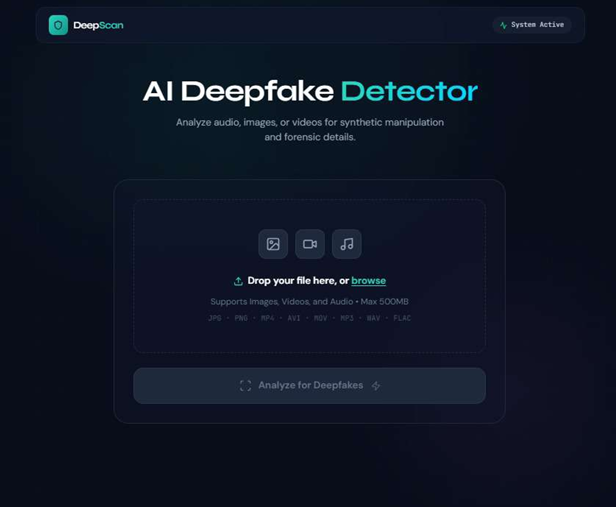
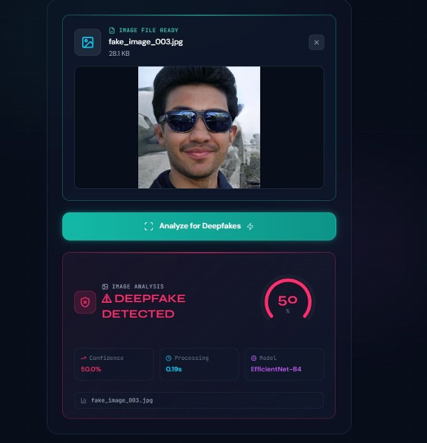
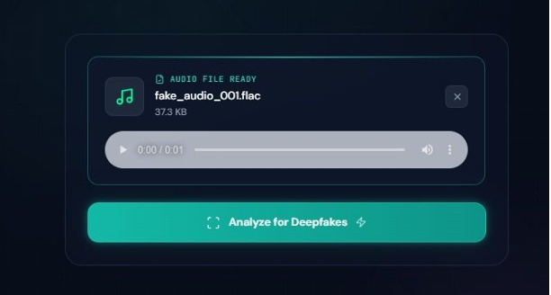
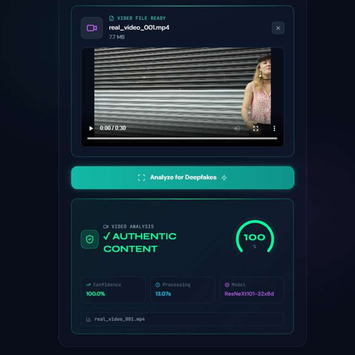

# DeepScan: Multimodal Deepfake Detection Using Audio-Visual Fusion Networks


# Multimodal Deepfake Detection Using Audio-Visual Fusion Networks



A multimodal deepfake detection system leveraging ResNeXt101, EfficientNet-B4, CNN-based audio analysis, and reliability-aware fusion for image, video, and audio deepfake detection.
## Overview

DeepScan is a multimodal deepfake detection system designed to identify manipulated content across images, videos, and audio recordings.

The system combines:

* Image Deepfake Detection using EfficientNet-B4
* Video Deepfake Detection using ResNeXt101 + MTCNN Face Extraction
* Audio Deepfake Detection using CNN-based Log-Mel Spectrogram Analysis
* Multimodal Fusion Framework for robust deepfake analysis

The project includes a Flask backend, React frontend, trained deep learning models, and research documentation.

---

## User Interface Preview

### Home Page


### Image Deepfake Detection



### Audio Deepfake Detection



### Video Deepfake Detection



---

## Features

### Image Deepfake Detection

* EfficientNet-B4 based classifier
* Face-aware deepfake analysis
* Real/Fake prediction with confidence score

### Video Deepfake Detection

* ResNeXt101 based frame-level detection
* MTCNN face extraction
* Suspicious frame selection
* Temporal deepfake analysis

### Audio Deepfake Detection

* CNN-based Log-Mel Spectrogram classifier
* Trained on ASVspoof2019-LA
* Synthetic speech and voice cloning detection

### Multimodal Fusion

* Audio-Visual fusion framework
* Reliability-aware decision making
* Improved robustness against modality-specific failures

---

# Project Structure

```text
Deepfake-detection-main/
│
├── backend/
│   ├── app.py
│   ├── config.py
│   │
│   ├── models/
│   │   ├── audio_model.py
│   │   ├── image_model.py
│   │   ├── video_model.py
│   │   └── weights/
│   │       └── .gitkeep
│   │
│   ├── routes/
│   │   ├── predict.py
│   │   └── health.py
│   │
│   ├── services/
│   │   ├── model_registry.py
│   │   ├── predict_service.py
│   │   ├── fusion_runner.py
│   │   │
│   │   ├── runners/
│   │   │   ├── image_runner.py
│   │   │   ├── video_runner.py
│   │   │   ├── audio_runner.py
│   │   │   └── image_fusion_runner.py
│   │   │
│   │   └── fusion/
│   │       ├── adaptive_visual_fusion.py
│   │       ├── suspicious_frame_selector.py
│   │       └── final_multimodal_fusion.py
│   │
│   ├── utils/
│   └── tests/
│
├── Frontend/
│   ├── src/
│   ├── public/
│   └── package.json
│
├── notebooks/
│   └── Training and experimentation notebooks
│
├── docs/
│   ├── Project_Report.pdf
│   └── Project_Presentation.pptx
│
├── datasets/
│   └── DATASETS.md
│
├── demo/
│   └── DEMO_LINKS.md
│
├── weights/
│   └── DOWNLOAD_MODELS.md
│
├── requirements.txt
├── frontend_api.js
├── README.md
└── .gitignore
```

---

# System Architecture

Input Media
(Image / Video / Audio)

↓

Preprocessing

↓

Individual Detection Models

* EfficientNet-B4 (Image)
* ResNeXt101 + MTCNN (Video)
* CNN Log-Mel (Audio)

↓

Fusion Layer

↓

Deepfake Probability Score

↓

Final Prediction

* Real
* Fake

---

# Datasets

Dataset details are provided in:

```text
datasets/DATASETS.md
```

Datasets used:

* FF++ (FaceForensics++)
* 140K Real and Fake Faces
* ASVspoof2019-LA
* LAV-DF
* Real-world YouTube videos

---

# Model Weights

Model files are not included in this repository due to GitHub size limitations.

Download instructions:

```text
weights/DOWNLOAD_MODELS.md
```

Place all downloaded files inside:

```text
backend/models/weights/
```

---

# Installation

## Clone Repository

```bash
git clone https://github.com/YOUR_USERNAME/Deepfake-detection-main.git

cd Deepfake-detection-main
```

---

## Create Python Environment

```bash
python -m venv test_env

test_env\Scripts\activate
```

---

## Install Dependencies

```bash
pip install -r requirements.txt
```

---

## Configure Environment

Copy:

```text
backend/.env.example
```

to:

```text
backend/.env
```

and update paths if necessary.

---

## Run Backend

```bash
cd backend

python app.py
```

Backend runs at:

```text
http://localhost:8000
```

---

## Run Frontend

```bash
cd Frontend

npm install

npm start
```

Frontend runs at:

```text
http://localhost:3000
```

---

# API Endpoints

## Image Prediction

```http
POST /predict/image
```

Supported:

* jpg
* jpeg
* png
* webp

---

## Video Prediction

```http
POST /predict/video
```

Supported:

* mp4
* avi
* mov
* mkv
* webm

---

## Audio Prediction

```http
POST /predict/audio
```

Supported:

* wav
* mp3
* flac
* m4a

---

# Technologies Used

### Backend

* Flask
* TensorFlow
* PyTorch
* OpenCV
* Librosa
* Scikit-Learn

### Frontend

* React.js
* Axios
* Tailwind CSS

### Deep Learning

* EfficientNet-B4
* ResNeXt101
* CNN
* MTCNN

---

# Research Contributions

* Multimodal Deepfake Detection Framework
* Audio-Visual Fusion Strategy
* Suspicious Frame Selection Mechanism
* Reliability-Aware Decision Pipeline
* Real-world Deepfake Evaluation

---

# Documentation

Project report and presentation:

```text
docs/
```

---

# Demo

Demo videos and walkthrough links:

```text
demo/DEMO_LINKS.md
```

---

# Author

Shubham Raj

B.Tech in Computer Science and Engineering (Data Science)

Final Year Project

---


## Contributors

- Shubham Raj (CSEDS/2022/054)
- Divyanshu Ranjan (CSEDS/2022/026)
- Sakshi Priya (CSEDS/2022/051)
# License

This project is intended for academic and research purposes only.
